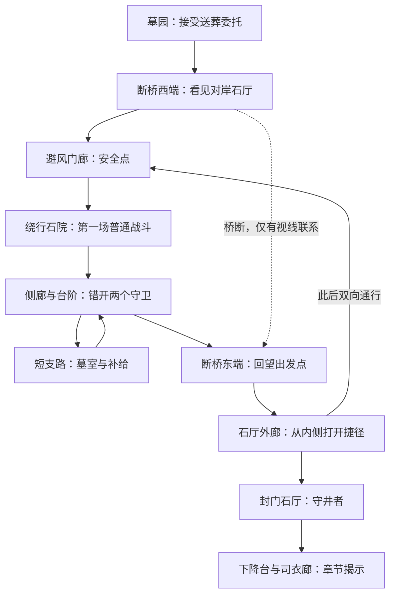

# 第一章地图与入口画面评审

2026-09-10。用户已确认：采用《未竟之日》作为第一章试做故事方向、采用主角三视图并允许小修正、接下来完成地图设计与场景基准图及 UE 可走灰盒。用户要求先对齐章节形态，并以第一章品质决定是否继续。当前处于画面评审，尚未开始本轮 UE 地图改造；Meshy 付费人物生成仍暂缓。

## 最新入口目标图

内置 image_gen 生成与编辑，是待评审视觉目标，不是 UE 实机截图或可达性能承诺。主角以[三视图](../../ArtDirection/Characters/hero-turnaround-v01.md)约束，已经纠正首轮肩甲和背剑镜像问题。

版本反馈：

- [v01](entrance-v01-weathered.png)：用户认为太脏。过多污迹、碎石、破布不作为后续基准。
- [v02](entrance-v02-bright.png)：用户认为太亮。干净不等于全画面通亮或石材泛白。
- v03：保留干净材质和完整披风，以阴天、冷色前景及对岸局部暖光调整。尚未得到用户对该图的最终认可。

用户要求的画面取向：电影感、可信材质、受控曝光；古老感主要来自建筑形态、尺度、局部结构缺损和光影。不把全场污损、纯黑阴影或满屏雾当成质感。

## 一章做成什么样

一片围绕断桥与封门石厅的可探索古城遗迹。首轮完整体验目标约 15–25 分钟（不含反复失败，待实测），让玩家完成“看见目标、绕路抵达、开捷径、战胜守门者、发现死人仍待加冕”的闭环。

上述为路线拓扑，不是比例施工图。图中巨大的深层城群只承担远景与世界深度；首章不承诺走遍远景。近处石厅必须真实抵达、能够进入，不做终点只有贴图的假目标。

空间连接：断桥跨越井缘支裂隙。首次路线沿裂隙头部岩壁的低位庭院与连廊绕行，再上到对岸；捷径沿头部高位短廊连接安全点与石厅外廊。捷径需要真实连续的地面与承重，不能用传送代替。入口图只展示部分路线，其隐藏段、具体高度与门的位置须在 UE 灰盒里确定；不得从图像臆称已经闭合。

## 品质标准与推进顺序

1. **空间先过关：**同一地图实际走完主路、支路和捷径；转身能对应先前地标，路面无卡点，镜头不频繁撞墙。
2. **关键视点做到可判断：**在断桥入口与石厅内各建立真实游玩视角，对照概念图检查建筑比例、材质、曝光和人物融合。灰盒通过不等于美术通过。
3. **战斗与重试过关：**普通敌人能逐步引入，Boss 前摇与落点可读，安全点到挑战点目标 10–20 秒；这些数值需实走验证。
4. **整章叙事闭合：**送葬委托、束链守门、战败后松链、下降与司衣人对白连贯；不要求读长日志才知道下一步。
5. **再决定是否扩展：**交付实际运行入口与固定镜头截图，分别报告完成、占位和未验证内容。若两个重点视点仍达不到用户的画面判断线，先修这片区域，不靠增加区域数量掩盖问题。

当前约定包含 UE 可走灰盒，主角正式模型仍是后续待办。因此不能把本轮占位主角或灰盒画质称为电影级成品；电影感是视觉目标，要由实机样段进一步验证。

## 生成记录

使用内置 image_gen，无 CLI 后备调用。初始提示词：[entrance-v01-prompt.txt](entrance-v01-prompt.txt)。后续编辑提示词与轮次说明见[编辑记录](entrance-revisions.txt)。所有图保留独立版本，当前选图以 v03 供评审。
