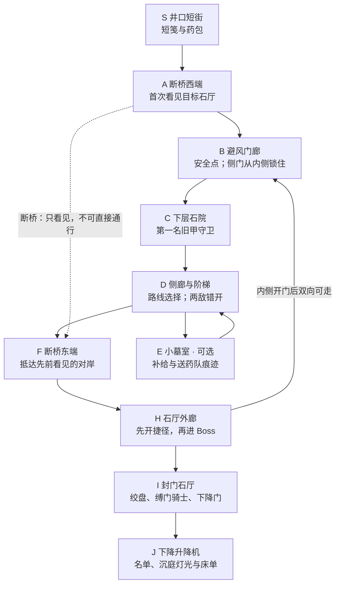

# AshWell · 第一章《断桥以下》关卡提案 v0.2

> 后续剧本（2026-09-10）：当前评审入口为[《未竟之日》v0.3](../Story/ash-well-screenplay-v03.md)。本文件保留为上一版姐姐救援与上下城候选；其中剧情不与新稿合并。关卡回环可参考，但尚未获得新剧情实现。

2026-09-10 · 待评审设计。以下路线、触发、检查点与时长都是目标，不是实机测试结果。

配套：[世界观](world-premise-v02.md)、[世界结构](world-map-v02.md)。已有实现以[旧第一章记录](../Implementation/chapter01-map.md)为准。

## 体验目标

玩家带药寻找失联姐姐，绕过断桥、抵达看得见的石厅、解开一条捷径，击败守门者后发现下面仍有人。

首次成功通关目标约 15–25 分钟，包含探索与一场 Boss，不含反复失败。Boss 单次尝试目标约 3–6 分钟，实际难度与时长由真人试玩校准；现有 5–10 分钟独立 Boss 样段仍保留。

## 路线关系图

这是关卡拓扑图，不是按比例的平面施工图。断桥两端是 A 与 F，初次无法直接跨越。

H→B 侧门打开后可双向通过。图中只画一次边避免交叉；正常死亡重试从 B 经侧门到 H，不再重走石院。A→F 虚线是视线与断裂关系，绝不是可走路线。

## 空间摆放草案

以井壁为背、深井为前的一个局部台地布置：S 在西上方；A 是向井中伸出的断桥西端；B 在 A 后方井壁内；C 在 B 下方；D 沿岩壁向东爬升；F 是断桥东端；H 位于 F 后方并贴近 B 的另一侧；I 在 H 东侧；J 继续向下。E 从 D 向岩壁内侧短距离分出并原路返回。

H 与 B 用短侧廊隔墙相邻，因此捷径开门是真实的空间连接。初次玩家被迫从 C、D 绕到墙后，开门时能看到先前的休息位置。不能通过长传送或突然改海拔伪装成捷径。

灰盒起始值：普通路线宽 2.5–4 米；非战斗短窄段可收至 1.8–2.2 米，须实测第三人称镜头；普通交战空间约 8×10 米；Boss 优先试用已有约 14×13 米场地，再依据重锤轨迹、闪避与镜头扩展净空。尺寸是初始建议，不是验收结论。

## 分段设计

| 段落 | 玩家做什么 | 画面与信息 | 目标耗时 |
|---|---|---|---|
| S→A 出发与开阔 | 接信和药包，穿过低矮石廊 | 不超过两句必要对话；走出廊道看见远处石厅与下方旧城 | 1–2 分钟 |
| A→B 确定路线 | 发现桥断，沿墙走进避风门廊，激活安全点 | 断口可读；锁住的侧门透出另侧光线，让捷径有预告 | 1–2 分钟 |
| B→C 首战 | 面对一个守卫，学习距离、闪避和反击 | 开阔平地，没有落崖干扰；倒地后确认路线继续 | 2–3 分钟 |
| C→D→F 探索 | 两个守卫分开布置，可依次处理；可去 E | 从院子、侧廊与台阶抵达刚才的对岸；短笺痕迹之一在主路 | 3–5 分钟 |
| E 可选 | 看一处墓室，拿少量现有补给 | 不放主线钥匙、不新增武器系统；跳过不影响理解 | 0–2 分钟 |
| F→H 回环 | 回看断桥，发现内侧门闩并开门 | 推门见到 B，理解自己走完一圈；可补给后立即挑战 | 1–2 分钟 |
| I 首领 | 操作绞盘触发守卫，读招、闪避、反击 | 重甲被拉索带起；二阶段表现束缚损坏，招式维持可读 | 3–6 分钟 |
| J 下行 | 读到短名单与去向，启动升降机 | 战后一句话；下方床单与灯火证明有人 | 1–2 分钟 |

分段范围用于预算，不要求各段都取上限；整体节奏需用灰盒实走校准。

## 敌人与失败体验

- 普通敌人：一种旧甲近战守卫，三次摆放；先单体学习，再在距离与遮挡上形成顺序处理。尚未实现的普通敌人是明确新增项，不能把现有 Boss 缩小就声称已完成。
- Boss：一名，优先复用现有重锤动作与三招、轻量二阶段。玩家长剑仍需完成握持与动画适配，当前锤子基础不等于已有长剑战斗成品。
- B 是本段唯一必要安全点。激活后死亡回到 B；快捷键调试重启与玩家死亡重生应分开定义。此持久状态是待实现目标，当前记录中的 R 行为不等于它。
- 捷径开启后在本段死亡重试中保持开启。普通敌人可重置，但捷径上不布敌；Boss 重试步行目标 10–20 秒，须原生实走核验。
- 道具拾取、药包与剧情线索在本段死亡中不重复发放。存档若未实现，明确仅在本次运行会话保持，不宣称支持跨启动保存。
- 不把基础战斗放在悬崖边，不要求跳跃跨断桥，不加首轮必死或强制掉落惩罚。

## Boss 触发与结束因果

绞盘连接下降门和守卫的约束机构。启动绞盘时，守卫按最后的封桥军令起身，强制卡住下降门；这个连接通过拉索受力、门卡住与守卫动作呈现。门打不开不是因为无说明的空气墙。

退到 H 可脱战重置；重入 I 后重新触发。解除束缚后的门状态与敌人失败状态一致，不能出现 Boss 已败但绞盘仍永久锁住。新状态机需后续实施，当前通电流程暂不改。

胜利提供通行权和线索。无需先强制读完长日志才允许离开；核心“姐姐去往沉庭”在短标记与名单上可读，补充细节可选。守卫短暂清醒的一句话配明确的门状态，不仅靠字幕解释设计。

## 与旧第一章的迁移关系

| 旧内容 | 新提案中的用途 | 需要做的工作 |
|---|---|---|
| 配给街、修泵 | 井口短街与出发动机 | 改开场交互与局部美术；不沿用修泵作为出发条件 |
| 下行矿道 | 低矮石廊与压缩视野 | 保留连续通过目标，减少全域钢架与服务管线 |
| 单一路线栈桥 | 断桥庭院与下层回环 | 重新布置局部路线、门闩和普通敌人；仅改材质不够 |
| 检修站 Boss | 封门石厅与缚门骑士 | 可复用战斗核心；新触发、外形与演出另做 |
| 战后记录、下行升降机 | 姐姐去向与沉庭预览 | 改线索、门状态和远景；不制作整个沉庭 |

本提案不删除当前地图，不覆盖独立 Boss 样段，不开展全世界建模或打包。

## 进入制作时的完成顺序与验收

1. 先用现有占位资产在 UE 做 A→B→C→D→F→H→B 的空间回环；验证门前后位置真实连贯。
2. 在 A 与 F 使用同一个石厅地标，确认第一眼看得见，最终能抵达，回看能认出出发点。
3. 加入安全点、捷径持久状态和一次可重试的战斗；死亡后不必重复开场交付。
4. 接入绞盘因果与升降机收束，处理退场、重试、胜利与退出重启的状态边界。
5. 对一个断桥视点与一个石厅游玩视点按当前美术规范打磨，再判断是否继续扩展。

关键评审问题是“是否想去那座石厅、开捷径是否有满足感、胜利后是否想继续往下”，不是资产数量。所有时长、尺寸、普通敌人与新状态尚未完成实机验证。
