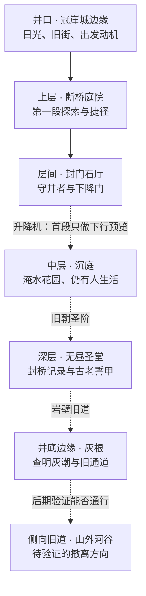

# AshWell · 世界纵向结构图 v0.2

> 后续剧本（2026-09-10）：当前评审入口为[《未竟之日》v0.3](../Story/ash-well-screenplay-v03.md)。本文件保留为上一版姐姐救援与上下城候选；其中剧情不与新稿合并。关卡回环可参考，但尚未获得新剧情实现。

2026-09-10 · 设计提案，非现有地图清单、正式测绘或制作排期。

配套：[世界观](world-premise-v02.md)、[第一章路线](chapter01-design-v02.md)。

## 世界结构

古城沿巨大天坑的台地与岩壁逐代向上加建。玩家整体下行，但每个区域内部包含横向穿越、绕行和回望。以下层位只表达相对关系，不设尚未验证的海拔与总面积。

实线表示本轮提议制作的第一段路线；虚线表示后续世界方向，尚不列入制作范围。

## 各区域必须不同

| 区域 | 主要画面 | 玩家为什么来 | 路线特征 | 本轮范围 |
|---|---|---|---|---|
| 冠崖城边缘 | 阳光落在高墙，旧屋顶承着新街道，井口很深 | 接回姐姐仍活着的消息，带药出发 | 安全短街通向下井石廊 | 只做出发角落，不做整座主城 |
| 断桥庭院 | 断桥、风化雕像、偏斜塔楼，远处可见石厅 | 沿送药队痕迹抵达下降门 | 主桥断裂，穿院绕回对岸；内开侧门形成捷径 | 第一段主体 |
| 封门石厅 | 古老石厅、绞盘、厚重守卫，光从高窗切入 | 打开下降通路，确认姐姐去向 | 宽阔战斗区；战前支路回到安全点 | 一场 Boss 和出口 |
| 沉庭 | 清水漫过花园下层，藤蔓爬上临光台地，新床单晾在旧柱间 | 寻找姐姐并发现被遗弃的居民 | 水面与屋顶道路；可见下层不能直接跳达 | 仅结尾远景；后续才设计通行 |
| 无昼圣堂 | 深蓝阴影、垂直光井、石阶和破损誓碑 | 找到绕过封桥系统的旧路线 | 礼仪正门与服务侧道形成层次 | 世界占位，不做资产清单 |
| 灰根 | 赭灰岩层、地火裂隙、原城地基，无需大型工厂 | 验证灰潮来源与侧向出口 | 风道与岩壁旧路；危险应可观察 | 世界占位，不做实时灰潮系统 |
| 山外河谷 | 开阔天空、流水与植被 | 检验居民是否真有出路 | 侧向离井，打破只能向上的假设 | 叙事方向，不承诺新增开放地图 |

这些区域不是六七张立即制作的大地图，也不对应必须打六七个 Boss。层数和名称可在评审后收缩。

## 视线与地理约束

1. 断桥庭院的石厅门楼必须在第一次开阔视点看见，最终从那里通过。这是第一段兑现远景目标的核心。
2. 从下方回看应能认出先前的断桥和出发高墙；不能用互不对应的远景贴片暗示连续世界。
3. 开放井口提供上层天光；中层花园处于开口附近，深部圣堂通过少量光井照明；井底不能无来源地长满阳光草地。
4. 水渠和瀑布可以串联层位，水流和结构必须沿重力与支撑关系成立。第一轮优先用静态远景表现，不先做水体模拟。
5. 第一章之外的轮廓不放可交互门标，不以地图图标暗示已能到达。完整世界图是内部设计草图，初期不直接作为玩家全知地图。
6. 井口边缘与山外河谷是不同方向：前者是上层定居点，后者是待查的旧侧向通道。撤离路线需要确认水源、灰潮影响和通行条件，看到阳光不等于已经安全。

## 世界空间带来的玩法

基本节奏是“看见地标 → 走入遮蔽 → 绕到对岸 → 回看旧路 → 打开捷径 → 下行露出新层”。区域内有选择，世界方向仍清楚。

第一段只实现一条主路、一条短可选支路和一个回环。不增加跨地区传送网络、骑乘、攀爬树或程序生成世界。
