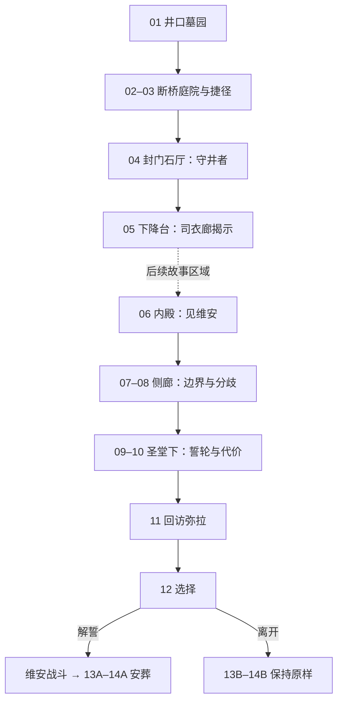

# 《未竟之日》· 演出、线索与关卡衔接

2026-09-10 · 配套[完整剧本 v0.3](ash-well-screenplay-v03.md)。本文是制作设计，未新增游戏实现。

## 演出基调

画面遵循[当前美术规范](../ArtDirection/art-direction-v1.md)：远看古城与深渊，近看有用途的绞盘、链条和配重。采用 UE 第三人称实时体验；不指定电影导演风格，不以 AI 视频替代玩家正在经历的事件。

主角的深色短发、膝部开衩斗篷、单侧旧肩甲与朴素长剑贯穿始终；没有突然换成检修工背包。葬牌开场包在布中、进殿时展开，结尾 A 留在墓座，结尾 B 带回。

视觉变化：井口自然午后 → 断桥开阔天光 → 下层异常稳定的金色 → 誓轮下冷色真实残墙 → A 保留自然傍晚、撤去旧光 / B 地下旧光不变。年代差通过同一建筑的风化与完整部位表现，不依靠现代终端解释。

保持玩家镜头为主。物件查看、可跳过交谈及关键短演出才取景；不强制玩家在危险边缘转镜头。没有战斗时的长对白，关键对白不与音效抢占。

## 主要戏剧转折

| 场次 | 原本相信什么 | 可看见的事件 | 此后要做什么 |
|---|---|---|---|
| 01–02 | 只是送葬差事 | 荒废古城里有守卫仍在迎宾 | 绕到石厅寻找下降路 |
| 04–05 | 守卫只是障碍 | 解开束缚后骑士想坐下；司衣人说王还未戴冠 | 亲眼见送葬对象 |
| 06 | 墓册可能弄错 | 国王读出自己死去的日期，承认外面已经过去很久 | 查明留下他的规则 |
| 07–08 | 可以把人带出去 | 弥拉无法越界；殿侍明确想留下 | 找到誓轮，确认结束的后果 |
| 09–11 | 解除机关也许是救人 | 试松主轮时形体淡去、回弹后恢复；弥拉明知后果仍想结束职责 | 在已知代价下决定是否解誓 |
| 12–14 | 王只是拒绝承认失败 | 他害怕臣民消失，也害怕没人记得；玩家留下名字或选择不动誓轮 | 完成或搁置葬礼，带着决定离开 |

## 世界与路线

首章空间回环可以借用[旧第一章提案](../Design/chapter01-design-v02.md)的 B→C→D→F→H→B 拓扑；姐姐、药包、送药队与沉庭活人线索不用于本稿。

本版只有一个誓仪保留的年代。图中下降意味着接近保存核心，不是每一层都要制作可切换的历史版本。以后若要扩展多时代，需重新检查规则，不能从一句“越往下越古老”自动引入时间旅行系统。

## 五处关键演出

下列秒数仅为演出预估，不包含玩家自由停留或战斗，未完成录音与实机验证。

| 场次 | 建议方式 | 位置与动作终点 | 必须让玩家明白 |
|---|---|---|---|
| 02 开阔 | 玩家背后视角，出廊道时声场自然展开，不锁镜头 | 断桥西端面向可达石厅；主要地标处于自然行进方向 | 有明确目的地，但正路断了 |
| 04 起身 | 首次约 6–8 秒可跳过的引擎演出 | 门抬起→棘爪卡住→链条拉起骑士→镜头回到安全开战位置 | 守卫和门的限制有物理联系 |
| 05 揭示 | 交谈中景与葬牌查看；对白按自然语速留停顿 | 玩家在桌外，弥拉先看内殿再回答 | 这趟送葬出现了事实冲突 |
| 07 越界 | 玩家可见的短固定动作，约 5–7 秒 | 弥拉手伸过石缝→指尖淡去→收回恢复 | 活人不能简单带走这里的人 |
| 13A 解誓 | 玩家拉柄后约 12–18 秒短演出，可跳过 | 轮转一格→链松→王形体消散→葬牌落定→交还控制 | 结束的是誓仪附着的存在，真实建筑仍在 |

制作关键帧时先固定断桥位置、石厅朝向、角色站位和物件接触；本轮仅写剧本，不生成分镜图、配音或视频，不设置未经验证的模型参数。

## 声音与对白

| 区域／事件 | 空间底声与环境 | 同步动作与点声 | 音乐取舍 |
|---|---|---|---|
| 墓园 | 开阔风、远处少量鸟声 | 铜牌擦拭、布包、硬币 | 开场先留自然声，避免预告悲剧 |
| 断桥 | 从石廊闷响过渡到风与落水 | 靴底、披风、旗杆触地 | 远景可短暂进入稀疏主题，不持续铺满 |
| 守井者 | 石厅低回声 | 棘爪、绷链、重锤；起身先听受力 | 战斗音乐在敌人取得行动权时开始；战后退去 |
| 司衣廊 | 很轻的屋内空气声、远处链响 | 剪刀落桌、针盒、指尖碰石 | 对话与边界演出不铺提示恐怖的强音 |
| 内殿 | 过于稳定的室内环境，无外界鸟声 | 空杯、王冠承盘轻碰、衣料 | 少量礼仪旋律，不能靠音量替王解释动机 |
| 解誓 | 旧环境层逐渐撤去，留下真实通风声 | 释放柄、松链、针盒合上、铜牌落石 | 给对白与物件声让位，不做强行凯旋配乐 |
| 结尾 B | 回到井口自然风 | 脚步与葬牌放回 | 地下礼仪旋律极轻延续，表达未结束 |

角色说话针对眼前的人和事。弥拉不朗诵世界规则，维安不进行长篇自辩。字幕支持重读；关键事实均有对应场景证据。配音待文本评审后制作，不因本稿而启动付费生成。

## 线索与收束核对

| 线索 | 首次出现 | 解释或回收 | 是否可漏 |
|---|---|---|---|
| 王名与三百年前的日期 | 01 墓座、葬牌 | 06 维安遮日期；12 不再遮；14 入册 | 核心，交付与交谈必须提供 |
| 礼未成不得卸守 | 03 石牌、04 台词 | 守卫解缚后坐下；09 誓仪释放规则 | 石牌可漏，行动不可漏 |
| 弥拉的左手与礼袍 | 05 | 07 边界、11 自主意愿、13A 合针盒 | 主路可见 |
| 近代访客碎杯 | 07 | 13A 不随旧形体消失，14A 带回作见证 | 拾取可选；不能成为结束必需品 |
| 其他人希望留下 | 08 殿侍 | 11 玩家复述、结尾 B 延续 | 必经对话；不能只做隐藏日志 |
| 主轮张力改变形体，回弹后恢复 | 09 | 12 选择说明、13A 完整释放后果 | 必经交互 |
| 王冠没有戴上 | 06 | 始终不戴；不是隐藏强化或神性二阶段 | 场景一致性 |

## 首章状态衔接建议

- 任务交付、捷径开启、守井者战败和司衣廊揭示分别记录一次性状态。当前游戏没有这些新剧情状态，以下是实施要求。
- 死亡重试保留捷径和已见交付；首次 Boss 起身可跳过，重试不强制重播。战后不让玩家再次被同一束链锁门。
- 首章休息点和死亡恢复先沿用已验证的玩法基础再适配；不要把世界观誓仪直接写成每次重生倒流全图。
- 离开 Boss 区重置尚未完成的战斗；战胜后再返回不复活剧情 Boss。退出进程是否保留状态须由存档实现验证，不能仅靠这份剧本宣称支持。
- 玩家跳过交谈时仍取得必要目标；葬牌内容可从任务记录重读；结局选择前明确列出“消失”与“继续留存”的后果。

## 工作范围与待验证项

本轮只新增剧本文档与入口。01–05 可作为下一段制作目标：出发角落、一个回环、一场 Boss 和一处对话空间。06–14 是完整故事后续，不在当前样段里预先搭建全图。

可以复用的是现有移动、重锤 Boss 战斗骨架、升降机与局部几何；普通敌人、主角长剑适配、NPC、古甲视觉、誓仪边界与维安战斗仍须实际制作。

阅读检查已覆盖：主角动机、送葬对象身份、无法护送的依据、双方意愿、释放后果、返程通路、物件连续性。尚未验证：对白录音长度、镜头遮挡、战斗公平性、实机时长、性能与情感效果。
